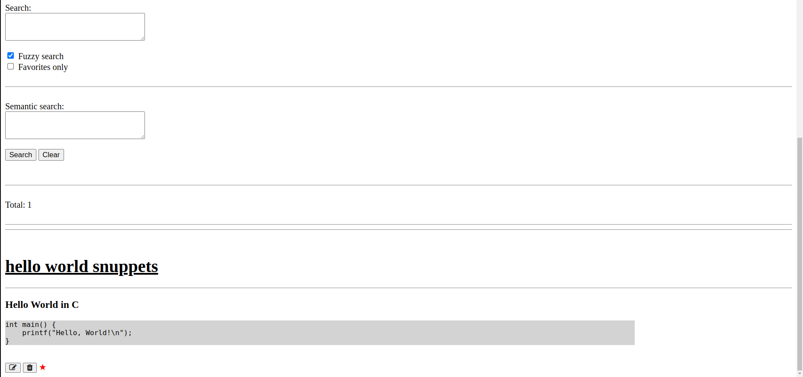

# CheatSheet

A productivity self-hosted tool to manage and browse cheatsheet and snippets
(in a [Markdown](https://en.wikipedia.org/wiki/Markdown) format).

This project is based on [Bookmarker](https://github.com/eranfrie/Bookmarker) code base.

<kbd>
  
</kbd>
<kbd>
  
</kbd>

### Search

Finding a cheatsheet is very easy.
The search is a multi-line search
where each line is matched independently
(`AND` relation between the lines),
either in a fuzzy or a full-match fashion.

### Semantic Search

In addition to the classic fuzzy/keyword-based search,
a semantic search is also supported.
Simply describe what you are looking for in a natural language
and the most relevant cheatsheet will be presented.

#### Privacy

Snippets are stored locally in a [SQLite](https://www.sqlite.org/index.html) database.
This is useful when you don't want to expose sensitive data (e.g., in your workplace) with third-party tools.
Note that it is recommended to periodically back up the SQLite file.


## Installation

##### Requirements:

1. Python 3.7 or higher

##### Linux / macOS:

1. Create a directory named `venv`
2. Run:
```
python -m venv <route/to/venv-directory>
source <route/to/venv-directory>/bin/activate
pip install -r requirements.txt
pip install -r requirements_ai.txt
```
Note: If you are not interested in running an LLM locally,
you can configure `enable_ai` to false
and skip the last command.


## Running the application

1. Activate the virtual environment: `source venv/bin/activate`
2. Run `python src/main.py`
3. From the browser: `http://localhost:8000`

## Tests

This project is well tested with unittests and end-to-end tests.
The code coverage is 98%.

The `build.py` script runs the following static code analysis and test suites:
- pycodestyle (pep8)
- pylint
- Unit tests
- End-to-end tests

To run `build.py`:
1. Activate the virtual environment: `source venv/bin/activate`
2. Install dev dependencies: `pip install -r requirements_dev.txt`
3. Run: `PYTHONPATH=src python build.py`

To check coverage:
1. `PYTHONPATH=src coverage run --concurrency=multiprocessing build.py`
2. `coverage combine`
3. `coverage html`
4. Open `htmlcov/index.html` in your browser
